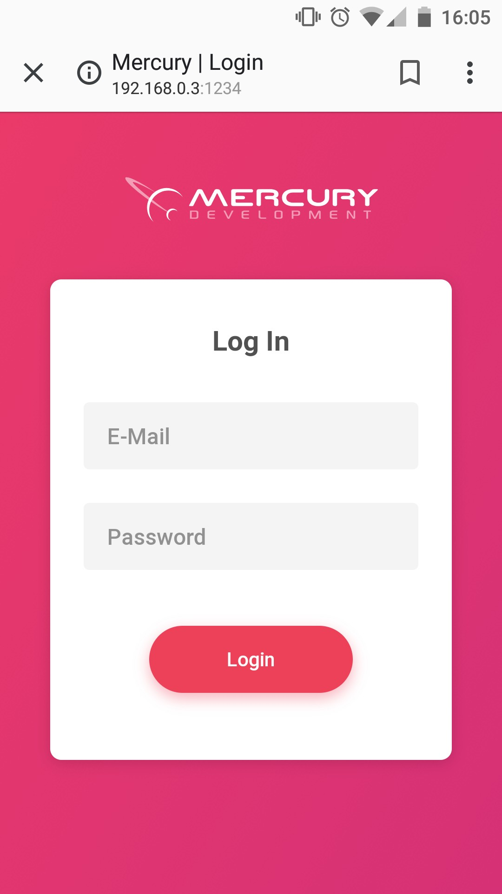

# Mercury-Test

Как запустить сайт у себя.
1. Скачать данный репозиторий.
2. Перейти в папку React.
3. Запустить index.html в браузере.

Пример приложения.

Скрин с телефона:

Запуск на мобильном устройстве был совершён с помощью сервера xampp по локальной сети.
